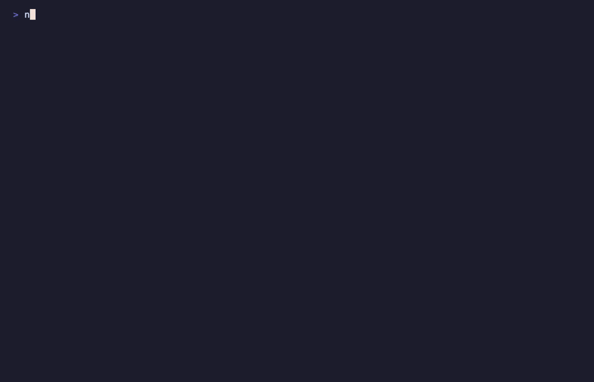

# Korean Text Rendering in Image Models — Benchmark

How accurately do text-to-image models draw **Korean (Hangul)** text? Most rendering benchmarks are English-centric and skip the writing systems where models actually struggle. This one measures it directly, reproducibly, with a single command.



## Leaderboard

9 text-capable models × 14 Hangul prompts. Each model draws the target text on a plain poster; the rendered text is transcribed by GPT-4o and scored by **character error rate (CER)**, lower is better. Whitespace is ignored.

| Rank | Model | Mean CER | Exact matches |
|---:|---|---:|---:|
| 1 | recraft-v4-pro | **0.000** | 14 / 14 (100%) |
| 2 | seedream-5 | **0.000** | 14 / 14 (100%) |
| 3 | nano-banana-pro | **0.000** | 14 / 14 (100%) |
| 4 | gpt-image-2 | 0.038 | 12 / 13 (92%) |
| 5 | recraft-v4 | 0.071 | 13 / 14 (93%) |
| 6 | gpt-image-1.5 | 0.083 | 12 / 14 (86%) |
| 7 | flux-2-flash | 0.145 | 9 / 14 (64%) |
| 8 | ideogram-v3 | 0.302 | 5 / 14 (36%) |
| 9 | imagen-4 | 1.332 | 0 / 14 (0%) |

Snapshot from 2026-05-29 via the fal.ai endpoints. Full per-prompt table in [REPORT.md](./REPORT.md), raw rows (including image URLs) in [results.json](./results.json).

## What breaks

Three models (recraft-v4-pro, seedream-5, nano-banana-pro) rendered every prompt perfectly, including the hard ones. The rest slip in revealing ways:

- **imagen-4 cannot write Hangul at all.** Every prompt came out as plausible-looking gibberish: `커피 한 잔` → `소동석 고려아는 아라해안`, `맑음` → `옹반재다`. 0/14, mean CER 1.33. A stark reminder that strong English text rendering does not transfer to Korean.
- **Complex jamo and tense consonants.** `떡볶이` → `덕볶이` (flux), `맑음` (cluster ㄻ) → `맘음` (flux); ideogram-v3 missed most of the harder set (5/14).
- **Longer / less common strings.** `주식회사 아이오브` came out of flux-2-flash as `주성휘브`; digits drift too (`커피 2잔` → `커피 22잔`).

## Reproduce

No dependencies beyond Node 18+ (uses global `fetch`).

```bash
export FAL_API_KEY=...      # image generation (fal.ai)
export OPENAI_API_KEY=...   # OCR (GPT-4o)
node run.mjs                # writes results.json + REPORT.md
node summary.mjs            # pretty-prints the saved results (used for the GIF)
```

Edit [`prompts.json`](./prompts.json) to add targets, or the `MODELS` list in [`run.mjs`](./run.mjs) to test more models. A full run is ~126 generations (a few dollars of API); `run.mjs` resumes from `results.json`, so re-running only retries failed cells.

## Method

- One image per (model, prompt) with an identical instruction: white poster, black sans-serif, the target Hangul as the only text. This isolates text rendering from style.
- GPT-4o transcribes the largest visible text; CER = Levenshtein(read, target) / |target|, whitespace stripped. CER 0 = perfect; exact-match rate = share of perfect renders.

## Honest limits

- **OCR is itself a model.** GPT-4o can misread, so CER is a proxy, not ground truth.
- **Small n.** One image per cell, no seeds or aspect ratios swept. Treat this as a snapshot, not a verdict; rerun for your own prompts.
- **Endpoints move.** Model versions and fal.ai paths change over time; the numbers are dated.

## Context

Part of IOV LABS research on verifiable quality for generative media: using cheap automatic checkers (OCR/CER here) as a gate and a routing signal. Korean text rendering was flagged as an open field in that note, this repo is the first measurement.

## Citation

A `CITATION.cff` is included, GitHub shows a "Cite this repository" button. 

## License

Code: [MIT](./LICENSE). The writeup and results may be reused under CC BY 4.0 with attribution.
